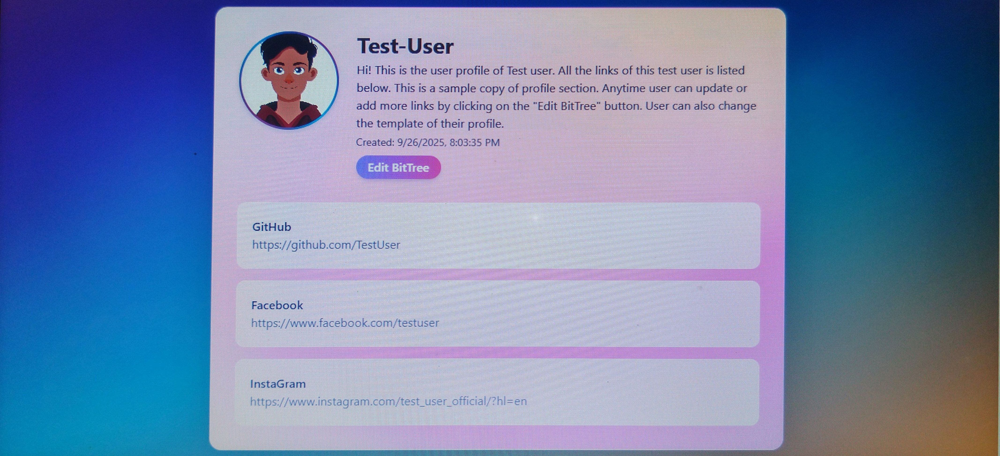
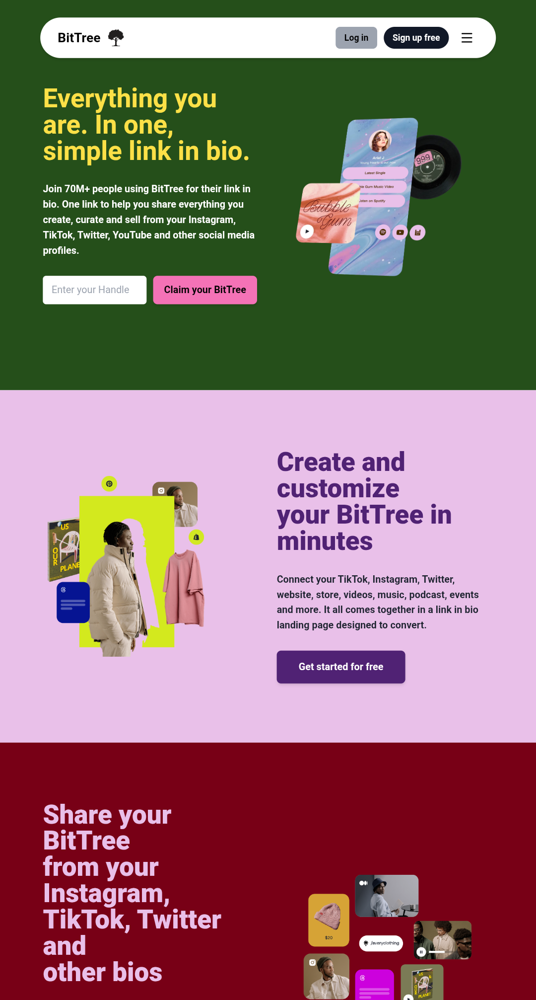
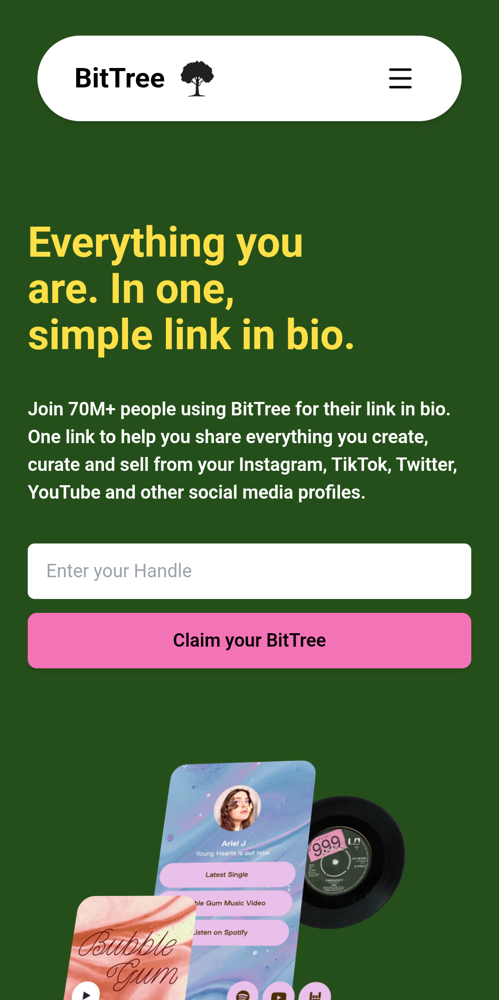

# 🌿 BitTree

BitTree is a **web application** where users can create their own profile and share all important links in one place.  
Built with **Next.js, MongoDB, TailwindCSS, and NextAuth**.

---

## 📸 Screenshots

### Home Page 


### Profile Page


### Responsive Mode(Tablet View)
<div align="center">
    
</div>

### Responsive Mode(Mobile View)
<div align="center">
    
</div>

---

## 🔗 Live Demo

👉 [BitTree](https://bittree-deba.vercel.app/)

---

## 🚀 Features

- 🔐 User Authentication  
  - Google login (via NextAuth)  
  - GitHub login (via NextAuth)  
  - Custom email/password login (via NextAuth Credentials Provider, JWT-based)  
- 👤 Custom profile pages with unique handles  
- ➕ Add and manage multiple links  
- 🎨 Responsive UI with TailwindCSS  
- 🗄 MongoDB database integration  
- ⚡ Deployed on Vercel  

---

## 🛠 Tech Stack

- [Next.js](https://nextjs.org/) – React framework
- [MongoDB](https://www.mongodb.com/) – Database
- [NextAuth](https://next-auth.js.org/) – Authentication
- [TailwindCSS](https://tailwindcss.com/) – Styling
- [Vercel](https://vercel.com/) – Deployment

---

## ⚙️ Installation & Setup

1. **Clone the repository**
   ```bash
   git clone https://github.com/2000Deba/BitTree.git
   cd BitTree
   ```

2. **Install dependencies**
    ```bash
    npm install
    ```

3. **Setup environment variables**    
    Create a .env.local file and add:
    ```bash
    MONGODB_URI=your_mongodb_connection_string
    NEXT_PUBLIC_HOST=http://localhost:3000
    NEXTAUTH_URL=http://localhost:3000
    NEXTAUTH_SECRET=your_secret
    GOOGLE_CLIENT_ID=your_google_client_id
    GOOGLE_CLIENT_SECRET=your_google_client_secret
    GITHUB_ID=your_github_client_id
    GITHUB_SECRET=your_github_client_secret
    EMAIL_USER=yourgmail@gmail.com
    EMAIL_PASS=xxxx xxxx xxxx xxxx   # App Password (must be entered without spaces)
    ```

    > Make sure to replace `your_mongodb_connection_string` with your actual MongoDB connection URI.

4. **Run the development server**
    ```bash
    npm run dev
    ```

The app will be available at 👉 http://localhost:3000

---

## 📦 Deployment

- Deploy easily on **Vercel** by connecting your GitHub repository.
Vercel will automatically build and deploy your project.

---

## 👨‍💻 Author

**👤 Debasish Seal**

- GitHub: [@2000Deba](https://github.com/2000Deba)
- Live Demo: [BitTree](https://bittree-deba.vercel.app/)

---

### ⭐ Don't forget to star this repo if you like it!